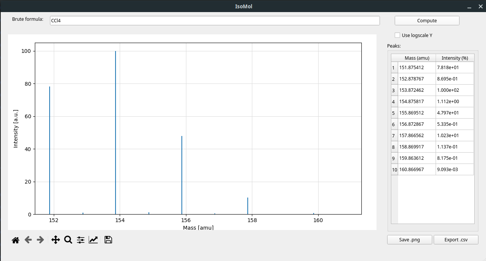

# IsoMol
A simple tool to compute the mass and abundance of different isotopic compositions of a given molecule.

The tool support both command line and GUI interfaces.

## Running IsoMol from command line
The basic requirements to run the `isomol.py` script in the console are a working `python>=3.8` installation and the `matplotlib` python library.

Once all the requiements are fulfilled the script can be executed using the command:

```
python isomol.py
```

The software will ask the user to input the brute formula of the compound and, once done, will output a terminal based table of masses and abbundances and open a graphical window with the abbundance plot.

As an example the isotopic patten associted to carbon tetrachloride can be easily obtained entering the `CCl4` brute formula that will return the following tabular output:

```
 Mass (amu) | Intensity  
--------------------------
  151.875412 | 7.8178e+01
  153.872462 | 1.0000e+02
  155.869512 | 4.7968e+01
  157.866562 | 1.0226e+01
  159.863612 | 8.1754e-01
  152.878767 | 8.6952e-01
  154.875817 | 1.1122e+00
  156.872867 | 5.3351e-01
  158.869917 | 1.1374e-01
  160.866967 | 9.0929e-03
```

## Running IsoMol using the GUI
To run the GUI interface, beside fulfilling the requirements of the command line tool (`python>=3.8` and `matplotlib`), a working version of `PyQt5` must be installed.

The GUI can be executed by simply running the `gui.py` script according to:

```
python gui.py
```

A graphical window should open allow the user to input the brute formula and compute the isotopic distribution pattern. An example of the GUI after computing the `CCl4` isotope pattern can be seen in the following image:



The obtained plot can be saved using the `Save .png` button while a `.csv` represenation of the peaks tabel can be saved using the `Export .csv` button.
